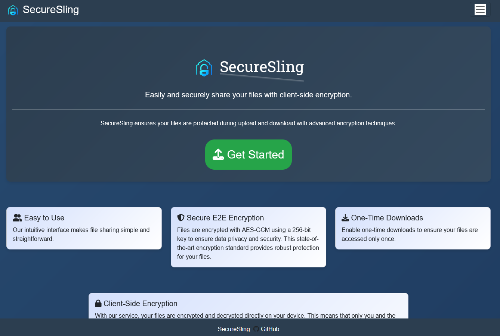
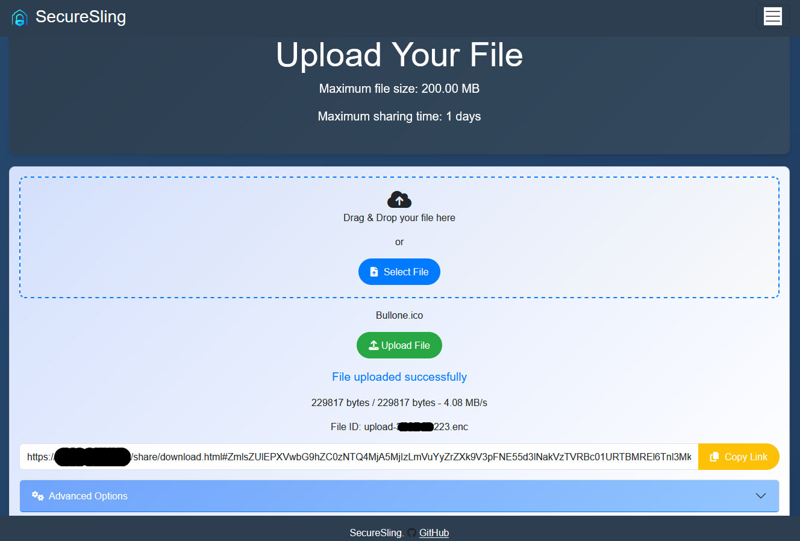
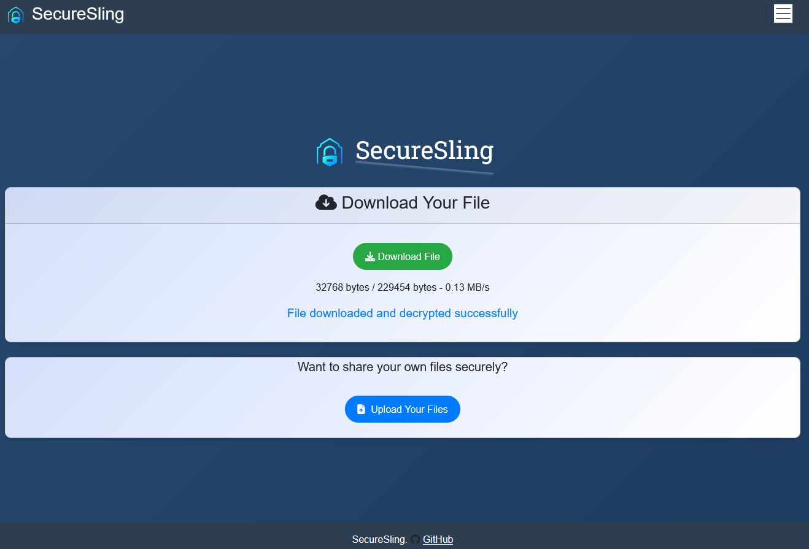

# SecureSling
## Easy to Use 🚀

SecureSling makes file sharing simple and straightforward with an intuitive interface that's easy to use.  
  
## Secure E2E Encryption & zero-knowledge architecture 🔒
  
Files are encrypted with AES-GCM using a 256-bit key to ensure data privacy and security. This state-of-the-art encryption standard provides robust protection for your files.
  
## Flexible File Sharing 📁
Enable one-time downloads to ensure your files are only accessible once  
Choose a maximum number of downloads  
Set an expiration date for your files  
Set Global expiration date (optional)  
Set Max Filesize  
File for configuration (config.yaml)  
Optionally choose a password to encrypt/access files 

## Client-Side Encryption 📱

With SecureSling, your files are encrypted and decrypted directly on your device.  
This means that only you and the recipient can access the content of the files.  
The server never have access to your unencrypted files, ensuring maximum privacy and security.  
You can optionally choose a password to encrypt files. In this case the password is required (in addition to the sharing link) to download the file.  

How it Works

- Encryption:
  - Before uploading, your files are encrypted using AES-GCM with a 256-bit key, a state-of-the-art encryption standard.
- Upload:
  - Only the encrypted version of your files is uploaded to our server. Also filename and metadata are safe thank to the zero-knowledge architecture.
- Decryption:
  - When downloading, the encrypted files are decrypted on your device using the decryption key you provided (in the sharing link).

## Password protected upload (Optional) 🔐  
You can choose to lock the upload section to ensure that no one without permission can share files.   
  
## Config
````
ServerPort: 8080 # Port the server will listen on
EnableTLS: false # Enable HTTPS (configure CertPathCrt and CertPathKey if true)
CertPathCrt: "/etc/letsencrypt/live/xxx/fullchain.pem" # Path to the SSL certificate file
CertPathKey: "/etc/letsencrypt/live/xxx/privkey.pem" # Path to the SSL certificate key file
MaxUploadSize: 5368709120 # Maximum upload size limit (Default: 5GB)
MaxExpireHours: 120 # Maximum time (in hours) before the file is deleted (Default: 120h)
EnablePassword: false # Enable password authentication for uploads (check credentials.yaml for configuration)
ShowUploadBox: true # Show or hide the 'upload your file'prompt on the download page
UploadDir: "./uploads" # Set Upoads dir location
ShowMenuDownloadPage: true # Show Menubar in downloadpage (if true add menu entry for index and upload page)
# Configuration for login attempt rate limiting
RateLimitPeriod: 60    # Time period (in seconds) for rate limiting login attempts
RateLimitAttempts: 5   # Maximum number of login attempts allowed per IP during the specified period
````  

## Screenshots 🖼️

| Screenshot |
| --- |
|  | 
|  | 
|  | 
|  | 

## Note 📝:
Only a randomly generated identifier that refers to the shared file is sent to the server.  
The link parameters for the decryption key and original file name are never sent to the server, so no one other than the recipient and the sender can decrypt the file.  
The server can work as either HTTP (if you use a reverse proxy, see next section) or HTTPS.  

## Docker 🐳  

It is possible to use an image on Docker Hub with the following command:

    docker run -p 8080:8080 --name securesling -v /home/user/config.yaml:/root/config.yaml -v /home/user/credentials.yaml:/root/credentials.yaml  jackyes/securesling:latest
    
`/home/user/config.yaml` is the path to your `config.yaml` file (copy and edit the one in this repository).  
`/home/user/credentials.yaml` is the path to your `credentials.yaml` file (copy and edit the one in this repository).  
Optional: `-v /home/user/uploads:/root/uploads` where `/home/user/uploads` is where ecrypted uploaded file are stored.  
change the default port `8080` accordingly with the one in config.yaml if you modify it.  
  
### Build Docker image yourself  
Follow these steps to build and run the Docker container:
````
git clone https://github.com/jackyes/SecureSling.git
cd SecureSling
# Edit config.yaml as needed
nano config.yaml
nano credentials.yaml
docker build -t securesling .
docker run -p 8080:8080 securesling
````
  
### Reverse proxy (nginx example, adjust settings as needed):
````
location /share/ {
    proxy_pass http://localhost:8080/;
    proxy_set_header Host $host;
    rewrite ^/share$ /share/ permanent;
    proxy_set_header Host $host;
    proxy_set_header X-Real-IP $remote_addr;
    proxy_set_header X-Forwarded-For $proxy_add_x_forwarded_for;
    proxy_set_header X-Scheme $scheme;
	
location /share/static {
   proxy_pass http://localhost:8080/static;
    proxy_set_header Host $host;
    proxy_set_header X-Real-IP $remote_addr;
    proxy_set_header X-Forwarded-For $proxy_add_x_forwarded_for;
    proxy_set_header X-Scheme $scheme;
}
````

